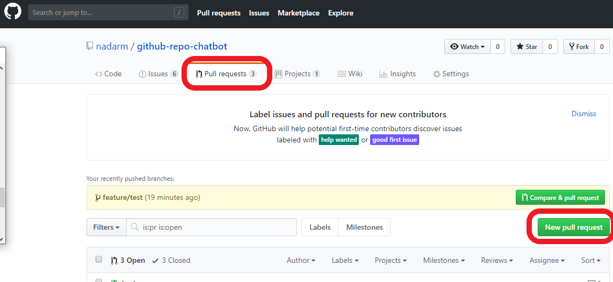
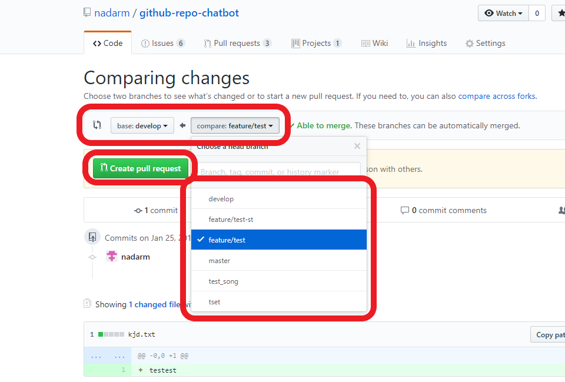
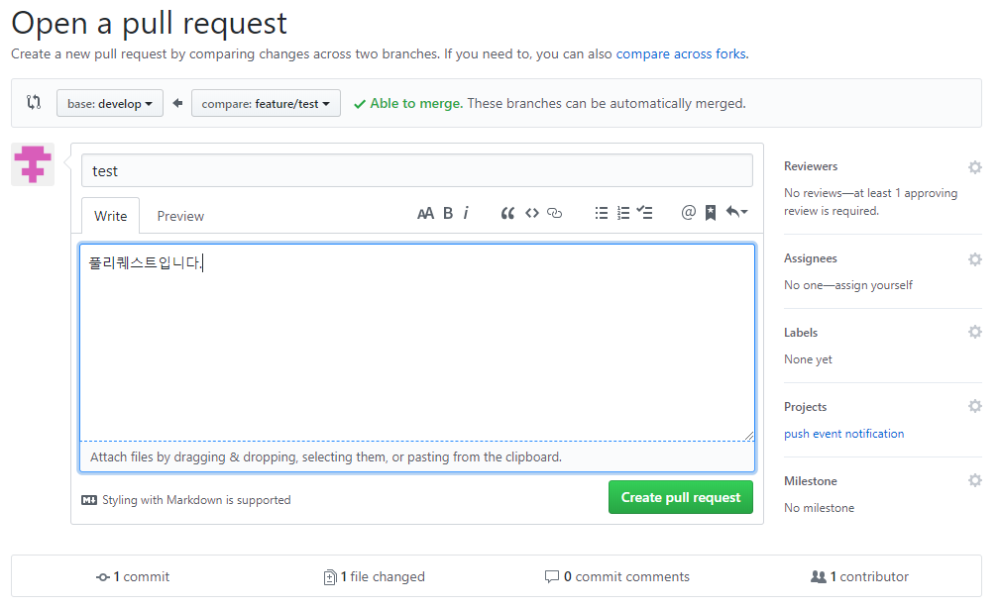
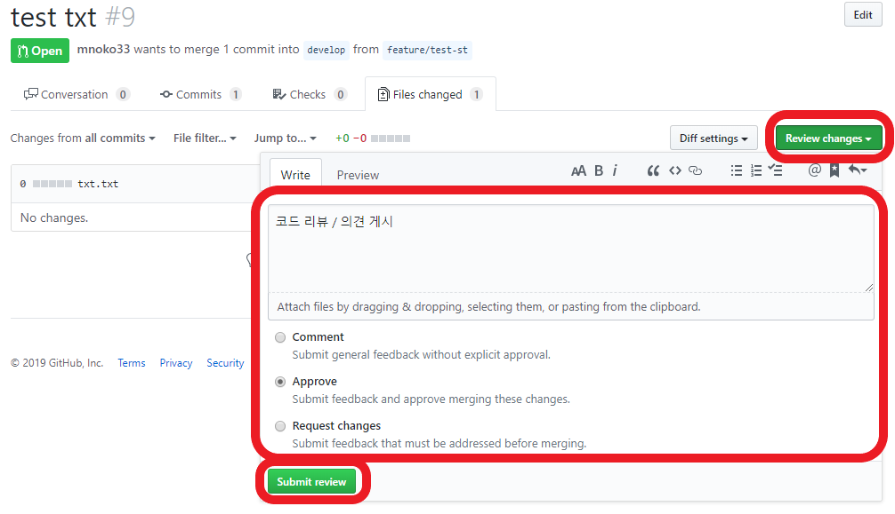
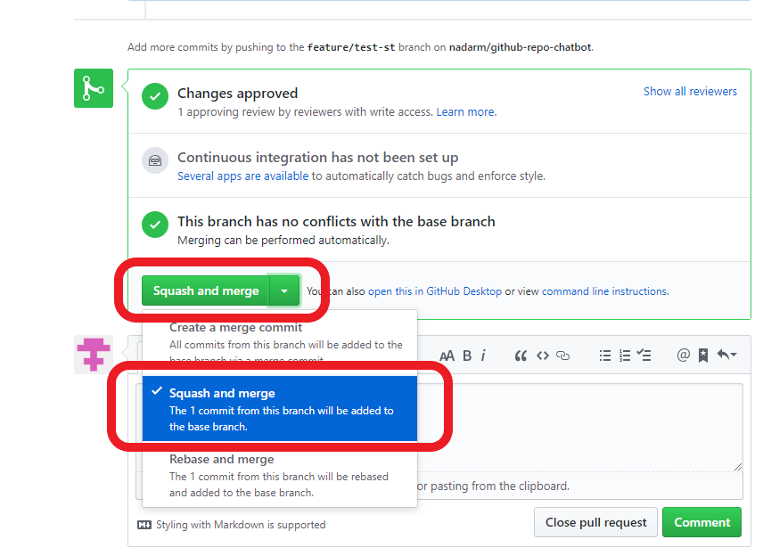
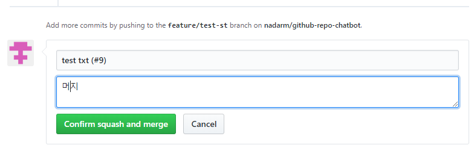
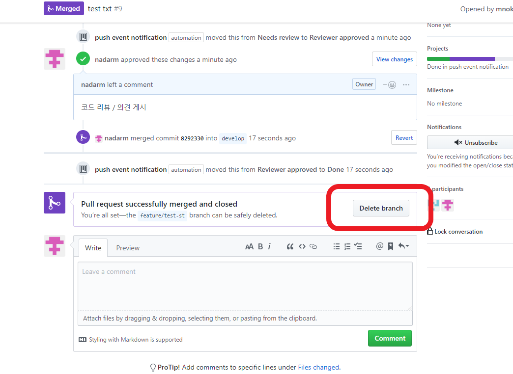

# git flow 

## 프로젝트 시작할 때

* 깃허브 저장소 클론하기

    ```bash
    $ git clone <깃허브 저장소 주소>
    ```


## 새로운 작업을 시작할 때

1. `develop`브랜치로 이동

    ```bash
    $ git checkout develop
    ```

2. `새로운 브랜치` 생성하고 이동

    ```bash
    $ git checkout -b <새로운 브랜치 이름>
    ```

3. 작업 하기

    ```bash
    $ git add <파일 이름>
    $ git commit -m '<커밋 메세지>'
    ```
    
    푸시를 처음할 땐 푸시할 원격 저장소를 지정해줘야 한다.

    ```bash
    $ git push -u origin <브랜치 이름>
    ```

    그 후엔 `$ git push` 명령어만 사용하면 된다.

    ```bash
    $ git push
    $ git pull
    ```


## `feature` 브랜치에서 작업을 모두 마치고 `develop` 브랜치로 `merge` 할 때

1. `feature` 브랜치에서의 모든 작업이 완료되면 커밋과 푸시를 했는지 확인한다.

2. `Github` -> `Pull requests` -> `New pull request` 를 누른다.

    

3. `base: develop <- compare: <브랜치 이름>`을 선택하고 `Create pull request` 버튼을 누른다.

    


4. 브랜치 관련된 정보를 적고 `Create pull request`버튼을 누른다.

    


## github pull request / code review / merge

1. 풀 리퀘스트를 요청하면 다른 팀원이 리뷰를 해주어야 머지가 가능하다.

2. 리뷰를 하기 위해 풀 리퀘스트에서 `Add your review` 버튼을 누른다.

    

3. `Review changes` 버튼을 누르고 의견을 적는다.

    * Comment - 의견만 게시
    * Approve - 브랜치 머지를 승인하고 의견 게시
    * Request changes - 브랜치를 머지하기 전에 해결해야 하는 의견 게시

    

4. 리뷰가 완료되면 풀 리퀘스트 페이지로 이동해서 `초록색 ▼`버튼을 누르고 `Squash and merge`를 선택한다. 그리고 `초록색 Squash and merge`버튼을 누른다.

    

5. 브랜치의 정보를 작성하고 `Confirm squash merge`버튼을 누른다.

    

6. 풀 리퀘스트가 완료되면 `Delete branch`버튼을 눌러 머지한 브랜치를 삭제

    

7. 머지된 `develop`을 `pull` 명령어로 최신화 한다.

    ```bash
    $ git checkout develop
    $ git pull
    ```

8. 머지가 완료된 브랜치를 삭제한다.

    ```bash
    $ git branch -d <머지를 완료한 브랜치 이름>
    ```