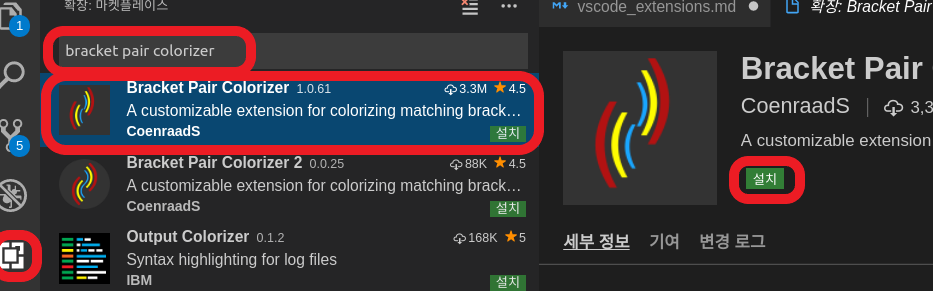
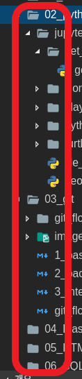

# VSCode Setting

## Setting

### 공백을 보기 편하게 `ㆍ`으로 표시하기

1. vscode의 설정으로 이동한다.

    

2. 검색창에 `Render Whitespace`를 검색한다.

    

3. `Render Whitespace` 옵션을 `boundary`로 설정한다.

4. 공백이 `ㆍ`로 표시된다.

    

## Extension

### Extension 설치 방법

1. `Extension` 탭을 열고 필요한 Extension을 `검색`한다.

    

2. Extension을 선택하고 `설치` 버튼을 누른다.

    

3. 설치 후 `다시 로드` 버튼을 누른다.

    

#### 추천 Extension

* Bracket Pair Colorizer

    

    * 괄호가 여러번 중첩될 때 괄호들을 `다른 색`으로 표시해준다.

    * 짝이 맞지 않는 괄호는 `빨간 색`으로 표시해준다.

        

* indent-rainbow

    

    * 인덴트를 단계별로 `다른 색`으로 표시해준다.

    * 잘못된 인덴트는 `빨간 색`으로 표시해준다. (만능은 아님)

        

* Auto Rename Tag

    

    * html tag를 수정할 때 앞 뒤 `한 세트`를 같이 수정해준다.

        

* Material Icon Theme

    

    * vscode의 탐색기에서 `폴더`와 `파일`을 `보기 좋은 아이콘`으로 표시해준다.

        

#### 쓸만한 Extension

* gitignore

    * `.gitignore` 파일 생성을 도와준다.

* Setting Sync

    * vscode의 `Setting`과 `Extension`을 Github Gist에 저장하고 공유한다.